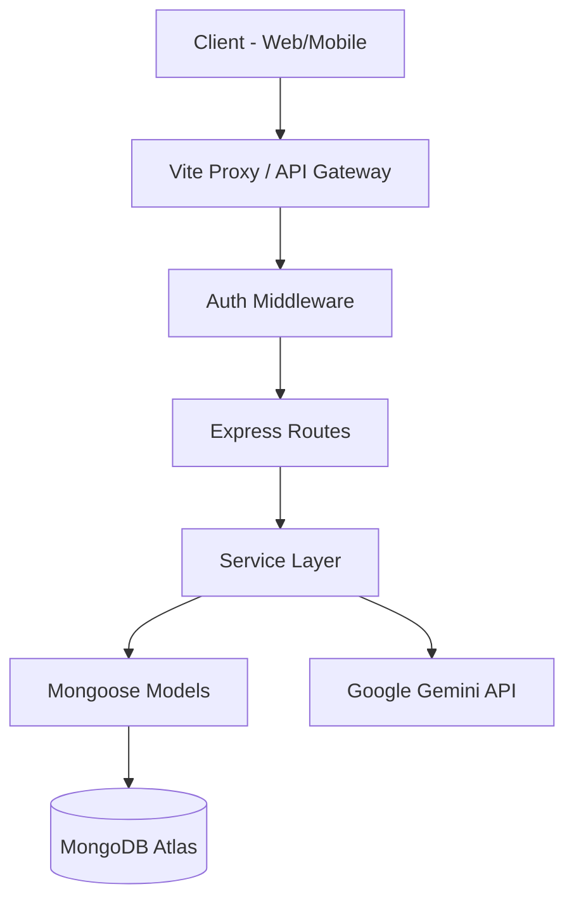

# 🛒 Savdo-E | Milliy Va Global Savdo Ekotizimi 🚀


Savdo-E — bu shunchaki onlayn do'kon emas, balki biznesingizni boshqarish, tahlil qilish va rivojlantirish uchun mo'ljallangan, sun'iy intelekt (AI) bilan boyitilgan zamonaviy ekotizimdir. Ushbu platforma orqali siz o'z savdolaringizni dunyoning istalgan nuqtasidan turib, eng zamonaviy texnologiyalar yordamida nazorat qilishingiz mumkin.

---

## 📋 Mundarija
1. [Loyiha Haqida](#loyiha-haqida)
2. [Asosiy Imkoniyatlar](#asosiy-imkoniyatlar)
    - [G‘arb Va Sharq UI/UX Dizayni](#premium-interfeys)
    - [Gemini AI Assistant](#gemini-ai-yordamchi)
    - [Global Lokalizatsiya](#ko‘p-tillilik)
3. [Texnologik Stack](#texnologik-stack)
4. [Tizim Arxitekturasi](#tizim-arxitekturasi)
5. [O‘rnatish Va Sozlash](#o‘rnatish-va-sozlash)
6. [API Endpoints](#api-yo‘nalishlari)
7. [Foydalanish Qo‘llanmasi](#foydalanish-qo‘llanmasi)
8. [Xavfsizlik Tizimi](#xavfsizlik)
9. [Loyiha Kelajagi (Roadmap)](#kelajak-rejalari)
10. [Litsenziya](#litsenziya)

---

## 🌟 Loyiha Haqida

**Savdo-E** — bu kichik va o'rta biznes (SME) egalari uchun maxsus ishlab chiqilgan, murakkab jarayonlarni soddalashtiruvchi platforma. Bizning maqsadimiz — an'anaviy savdoni raqamli dunyoga, sun'iy intelektning kuchidan foydalangan holda olib kirishdir.

Ushbu platforma uchta asosiy ustunga tayanadi:
1. **Tezlik**: React va Vite yordamida eng tezkor interfeys.
2. **Aqlli Tahlil**: Gemini AI orqali har bir sotuvni tahlil qilish.
3. **Erkinlik**: Istalgan tilda, istalgan qurilmada (Veb va Mobil) foydalanish imkoniyati.

---

## 🔥 Asosiy Imkoniyatlar

### 🤖 Gemini AI Yordamchi
Sizning do'koningizda endi 24/7 ishlaydigan aqlli menejer bor! 
*   **Ombor Tahlili**: "Omborda nima qoldi?" savoliga soniyalar ichida javob beradi.
*   **Biznes Maslahatlari**: Foydani qanday ko'paytirish bo'yicha professional tavsiyalar.
*   **Muloqot**: O'zbek, rus va ingliz tillarida insondek suhbat quradi.
*   **Statistika**: "Oxirgi 10 ta sotuv qanday o'tdi?" kabi tahliliy ko'rsatkichlarni taqdim etadi.

### 🌍 Ko‘p Tillilik (i18n)
Savdo-E dunyo bozoriga moslashgan. 
*   **UZ**: O'zbek tili (Lotin va Kirill uyg'unligi).
*   **RU**: To'liq rus tili qo'llab-quvvatlanadi.
*   **EN**: Xalqaro biznes tili — Ingliz tili.
*   **Dinamik**: Sana, vaqt va valyuta belgilarining (UZS, RUB, USD) avtomatik o'zgarishi.

### 📊 Professional Hisobotlar
*   **Kunlik Xulosa**: Bugungi tushum, sof foyda va sotilgan tovarlar soni.
*   **Oylik Analetika**: Biznesingiz o'sish dinamikasini grafiklar orqali kuzatish.
*   **Top Products**: Qaysi mahsulotingiz eng ko'p foyda keltirayotganini aniqlash.

---

## 🛠 Texnologik Stack

### 🚀 Backend
*   **Node.js & Express**: Yuqori yuklamalarga chidamli server qismi.
*   **MongoDB & Mongoose**: NoSQL bazasi orqali ma'lumotlarni moslashuvchan saqlash.
*   **JWT & Bcrypt**: Shifrlangan avtorizatsiya va xavfsiz parollar.
*   **Google Gemini SDK**: Sun'iy intelekt integratsiyasi.

### ⚛️ Web Frontend
*   **React 18 & Vite**: Zamonaviy, komponentli UI.
*   **Zustand**: Global holatni (State) boshqarish.
*   **TanStack Query**: API bilan ishlash va kesh tizimi.
*   **Tailwind CSS**: Premium va minimalist dizayn.
*   **i18next**: Lokalizatsiya va tillar boshqaruvi.

### 📱 Mobile (React Native)
*   **Expo**: Tezkor mobil ilova ishlab chiqish muhiti.
*   **React Navigation**: Ilova ichida qulay navigatsiya.

---

## 🏗 Tizim Arxitekturasi

Loyihamiz **MVC (Model-View-Controller)** va **Service Layer** patternlari asosida qurilgan. Bu tizimni kelajakda kengaytirishni juda oson qiladi.



### 📁 Papkalar Strukturasi
*   `/backend`: API serveri, Controllerlar, Modellar va Biznes logika.
*   `/web`: React veb-ilovasi, Komponentlar, i18n va API qatlami.
*   `/mobile`: React Native (Expo) mobil ilovasi.
*   `/docs`: Texnik hujjatlar va API referenslari.

---

## ⚙️ O‘rnatish Va Sozlash

### 1. Prerekvizitlar
*   Node.js (v18 yoki undan yuqori)
*   MongoDB Atlas yoki Local MongoDB
*   Gemini API Key (Google AI Studio)

### 2. Backend O‘rnatish
```bash
git clone https://github.com/user/savdo-e.git
cd savdo-e/backend
npm install
```
`.env` faylini yarating va quyidagilarni qo'shing:
```env
PORT=5002
MONGO_URI=mongodb://localhost:27017/savdo_db
JWT_ACCESS_SECRET=your_secret_key
GEMINI_API_KEY=AIzaSy...your_key
```
Ishga tushirish:
```bash
npm run dev
```

### 3. Web Frontend O‘rnatish
```bash
cd ../web
npm install
npm run dev
```
Saytni brauzerda oching: `http://localhost:5173`

---

## � API Yo‘nalishlari

### 🔐 Avtorizatsiya
*   `POST /api/v1/auth/register` - Ro'yxatdan o'tish
*   `POST /api/v1/auth/login` - Tizimga kirish
*   `POST /api/v1/auth/logout` - Chiqish

### 📦 Mahsulotlar
*   `GET /api/v1/products` - Barcha mahsulotlar
*   `POST /api/v1/products` - Yangi mahsulot qo'shish
*   `PATCH /api/v1/products/:id` - Mahsulotni tahrirlash

### 🤖 AI Xizmati
*   `POST /api/v1/ai/ask` - AI yordamchiga savol berish (Bearer token talab qilinadi)

---

## 🛡 Xavfsizlik

Xavfsizlik biz uchun birinchi o'rinda:
*   **Helmet.js**: HTTP sarlavhalarini himoya qilish.
*   **CORS Policy**: Faqat ruxsat etilgan domenlardan so'rovlarni qabul qilish.
*   **Rate Limiting**: API so'rovlariga limit qo'yish orqali DDOS hujumlaridan himoyalanish.
*   **Mongo Sanitize**: NoSQL Injection hujumlarining oldini olish.
*   **JWT Rotation**: Kirish tokenlarini doimiy ravishda yangilab turish.

---

## � Kelajak Rejalari (Roadmap)

- [ ] **Offline Mode**: Internet yo'q joyda ham savdo qilish imkoniyati.
- [ ] **QR Code Generator**: Har bir mahsulot uchun QR va Shtrix-kod yaratish.
- [ ] **Telegram Bot**: Savdolarni Telegram orqali nazorat qilish.
- [ ] **Multi-Store Support**: BIR NECHTA do'konni bitta akkauntdan boshqarish.

---

## 👨‍💻 Mualliflar

Ushbu platforma eng so'nggi dasturlash trendlarini o'zida mujassam etgan. Loyiha ustida ishlayotgan jamoamiz xavfsizlik va foydalanuvchi interfeysiga (UI) alohida urg'u berishgan.

---

## 📄 Litsenziya

Ushbu loyiha **MIT Litsenziyasi** asosida tarqatiladi. Savdo-E platformasini xohlaganingizcha o'zgartirishingiz va biznesingiz uchun ishlatishingiz mumkin.

---
**Savdo-E — Biznesingiz endi sizning qo'lingizda!** 💸🏢
